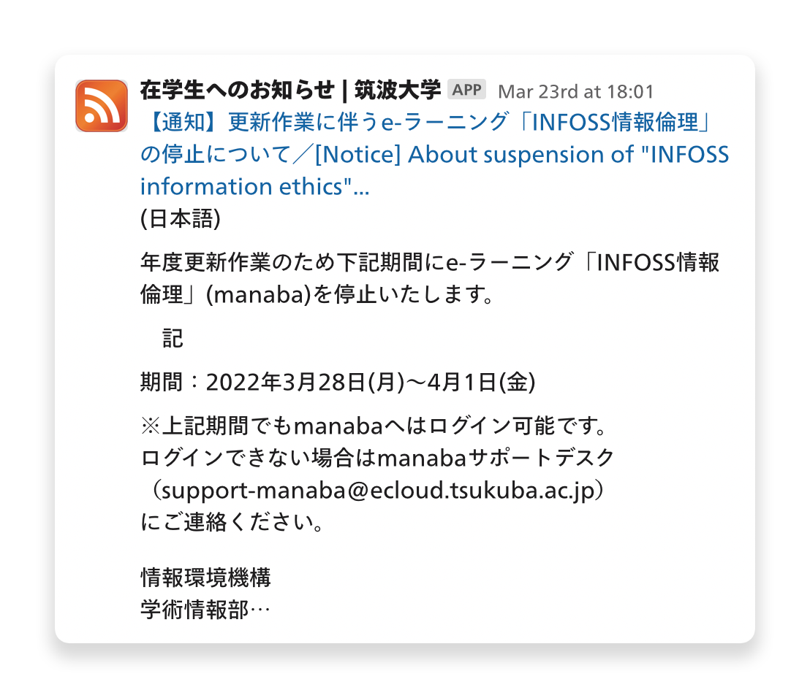

# twins-announcements

TWINS の「在学生へのお知らせ」を定期的にスクレイピングし、RSS/Atom などのフィードとして提供しています

更新時の通知を受け取るには、各種フィードリーダーで購読するほか、Slack の [RSS App](https://slack.com/apps/A0F81R7U7-rss) を用いてチャンネルに転送するのがおすすめです



## 各形式のフィード

- [RSS](https://mkobayashime.github.io/twins-announcements/twins-announcements-rss2.xml)
- [Atom](https://mkobayashime.github.io/twins-announcements/twins-announcements-atom1.xml)
- [JSON Feed](https://mkobayashime.github.io/twins-announcements/twins-announcements-json1.json)

## 特徴

TWINS トップページのお知らせ欄のリンクはお知らせページへのリンク URL を持たないため、[Feed43](https://feed43.com/) などの HTML を静的に解析してフィード化するサービスでは各お知らせへの直リンクを取得することができません

twins-announcements は [Playwright](https://playwright.dev/) を用いてブラウザ挙動を再現し、実際に TWINS のページ上でお知らせを表示させた上で情報を取得しているため、直リンクやお知らせの本文などを提供しています

## 免責事項

本ソフトウェア/フィードは mkobayashime が個人的に提供するものであり、筑波大学当局とは無関係です

私は利用に伴って発生したいかなる損害にも責任を負いませんので、あらかじめご了承ください

また、事情により一時的/恒久的に提供を取りやめる可能性があります

## Development

```sh
make run # 実行
```

以下の環境変数を設定することで実行時の挙動を調整することができます

`.envrc.sample` を `.envrc` にコピーし、[direnv](https://github.com/direnv/direnv) などを用いて load するのがおすすめです

| name                | description                                                                     |
| ------------------- | ------------------------------------------------------------------------------- |
| `HEADLESS`          | `true` の場合 Playwright をヘッドレスで実行する                                 |
| `FORCE_FULL_FETCH`  | `true` の場合最新のお知らせが前回実行時と変わっていなくても処理をスキップしない |
| `FEED_ITEMS_NUMBER` | 取得するお知らせの最大数                                                        |

設定する値については `.envrc.sample` や `src/index.ts` などを参照ください
